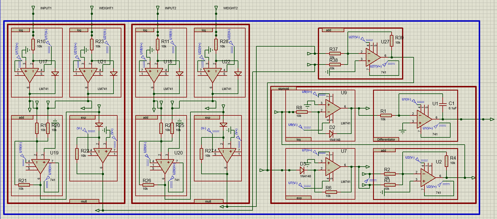
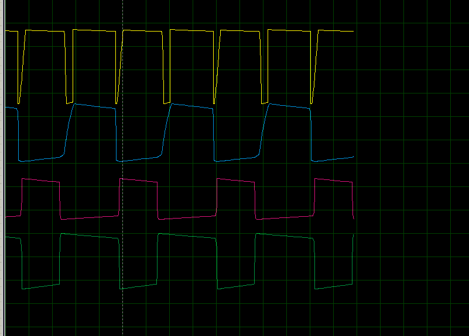
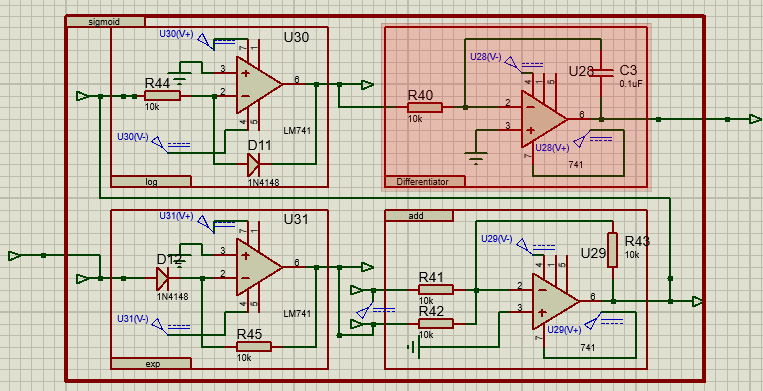
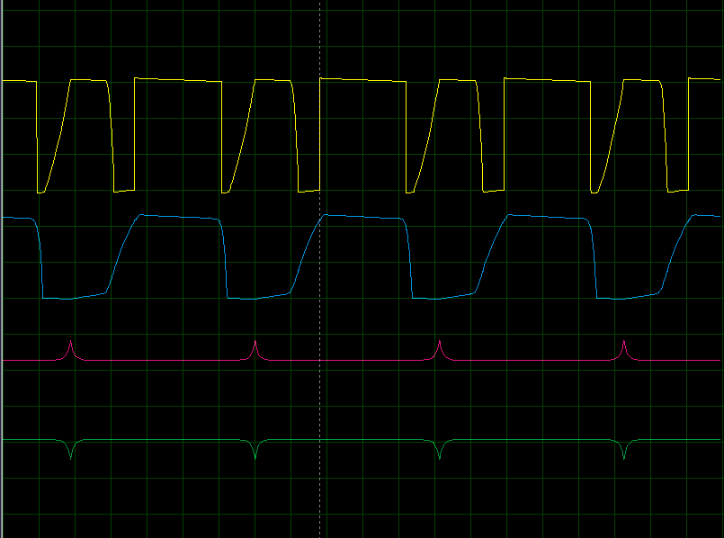

# Perceptron Implementation Using Op-Amp Circuits in Proteus

This project demonstrates the implementation of a perceptron using op-amp-based circuits in Proteus. The perceptron uses weights obtained from training in Python, processes two input signals, and predicts the output using a sigmoid activation function. This hardware-based implementation bridges the gap between theoretical machine learning concepts and real-world electronics.

---

## Project Structure

| File/Folder            | Description                                                                                   |
|------------------------|-----------------------------------------------------------------------------------------------|
| **gradient.pdsprj**    | Proteus project file containing the circuit diagram for the perceptron implementation.        |
| **sigmoid.png**        | Circuit diagram for the sigmoid function implemented using op-amps in Proteus.               |
| **sigmoid_output.png** | Output graph of the sigmoid function, showing its characteristic S-shaped curve.             |
| **perceptron.png**     | Circuit diagram of the perceptron, including weighted summation and bias integration.         |
| **perceptron_output.png** | Graph showing the perceptron output for various input values before applying the sigmoid.   |
| **sample.py**          | Python script for data generation and perceptron training. Outputs weights for the circuit.  |

---

## How It Works

1. **Data Generation and Training**:
   - The `sample.py` script generates synthetic data (e.g., hours studied and slept) and trains a perceptron using Python.
   - The trained weights and bias are extracted and used in the hardware implementation.

2. **Hardware Perceptron**:
   - The perceptron circuit (in `gradient.pdsprj`) performs a weighted summation of two input signals.
   - The summation is then passed through a sigmoid activation function (as shown in `sigmoid.png`).

3. **Output Verification**:
   - The perceptron output (`perceptron_output.png`) shows the raw summation values for various input combinations.
   - The sigmoid output (`sigmoid_output.png`) verifies the correct activation function response, converting the summation into probabilities (0 to 1).

---

## Key Components

1. **Circuit Design**:
   - Perceptron: Implemented using op-amps for weighted summation and bias addition.
   - Sigmoid: Built using diodes/transistors and feedback mechanisms for analog sigmoid approximation.

2. **Data Flow**:
   - Inputs: Two analog signals representing feature values (e.g., hours studied, hours slept).
   - Weights and Bias: Pre-trained values applied using precision resistors and a voltage source.
   - Output: Analog signal representing the perceptron’s prediction (0 for "Fail", 1 for "Pass").

3. **Graphical Validation**:
   - All stages of the perceptron, from summation to activation, are validated through graphs (`perceptron_output.png` and `sigmoid_output.png`).

---

## Usage

1. Open `gradient.pdsprj` in Proteus to view and simulate the perceptron circuit.
2. Modify input signals in the circuit simulation to observe changes in output.
3. Use the `sample.py` script to retrain the perceptron model and generate updated weights.
4. Replace the weights in the hardware circuit to test with new data.

---

## Results

- **Perceptron Output**: Demonstrates correct weighted summation for various input values.
- **Sigmoid Output**: Accurately maps the summation values into probabilities, as expected in a perceptron.

---

## Future Enhancements

1. **Dynamic Weight Adjustment**:
   - Add mechanisms for in-hardware learning or real-time weight updates.

2. **Extended Functionality**:
   - Implement multi-layer perceptrons using cascaded op-amp circuits.

3. **Visualization**:
   - Integrate Proteus with Python to visualize real-time outputs dynamically.

---

## Screenshots

### Perceptron Circuit

### Perceptron Output

### Sigmoid Circuit

### Sigmoid Output

---

